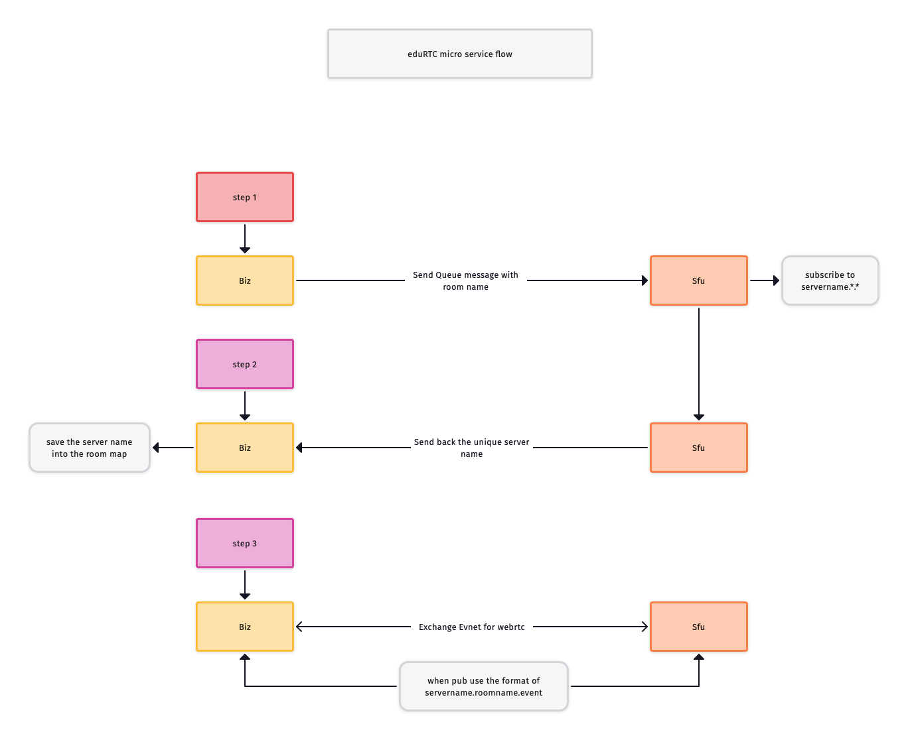

# eduRTC backend scalable micro services structure

## Summary
eduRTC stack has been design with an highly scalable solution for video conferencing system for educations, with this auto scale solution, we can spin up new sfu server as we need it, and the stack will discover it automaticlly.

## flow chart
